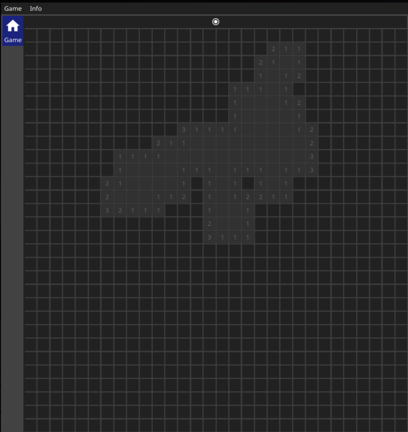
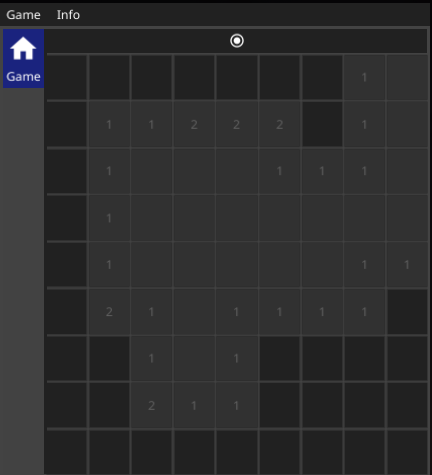
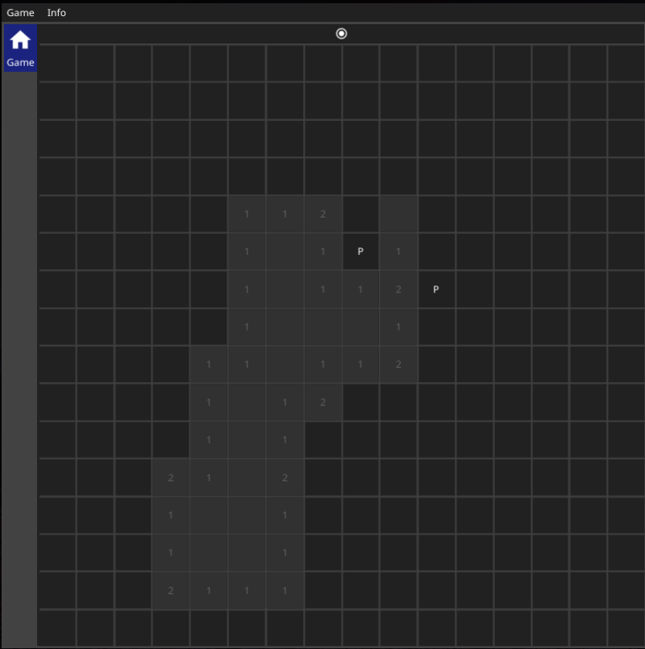

# Gosweeper

This is a very simple rip off of [Minesweeper](https://en.wikipedia.org/wiki/Minesweeper_(video_game)) written in Go. This is my first &ldquo;project&rdquo; in Go and it was meant to teach me the basics of the language. The [Fyne](https://github.com/fyne-io/fyne) library is used for the graphical parts. It doesn&rsquo;t perform as optimally as I would like it too, but it gets the job done.


The controls are as in the original game. The one caveat is that the middle click is not supported. In the `Game` menu, the player can choose the board size. Currently only the following boards are supported:

-   size 9x9 (10 mines)
-   size 16x16 (40 mines)
-   size 30x30 (120 mines)

Flags are marked with &ldquo;P&rdquo;. You can also restart the game by clicking the dot near the to bar.


Here are couple of screenshots:






## Code

The game is written very ugly. In my defense, I just wanted to get going with Go. I now know what ugly code in Go looks like. When you write a bad program, it becomes really obvious what can be done better and in what way. Hopefully, my next project will be prettier.


## Installation

The project is &ldquo;go get&rdquo;-able. To install the binary that is the game, just execute:

```sh
go get github.com/palikar/gosweeper/cmd/gosweeper
```

This should do the trick for any Linux based system. I have not yet tested the game on Windows or Mac OS.
